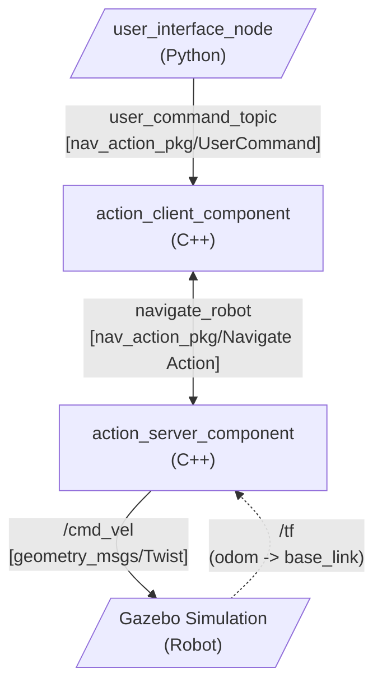

# Robot Navigation Assignment (`rt2_assignment1`)

## Overview
This repository contains a ROS 2 package architecture designed for commanding and executing robot navigation tasks. The project implements a complete robot navigation system using C++ and Python components in ROS 2, leveraging ROS 2 Actions for robust goal execution, preemptions, and feedback.

The workspace is divided into three main packages:
1. `nav_action_pkg`: A C++ package providing the Action Server and Action Client components, as well as the custom ROS 2 message and action interfaces.
2. `nav_ui_pkg`: A Python package providing a command-line user interface to send navigation commands.
3. `bme_gazebo_sensors`: A package containing the Gazebo simulation environment and robot models.

## Package Structure

### `nav_action_pkg`
This package is the core of the navigation stack. It utilizes ROS 2 component nodes for dynamic composition and efficient execution.
- **`ActionServerComponent`**: Implements the `navigate_robot` action server. It calculates the required `cmd_vel` commands using proportional control (P-controller) based on the robot's current pose (from `tf2` `odom` to `base_link`) and the target pose.
- **`ActionClientComponent`**: Implements the action client. It subscribes to the user command topic, bridges the UI requests to the action server, and handles goal preemption/cancellations.
- **Custom Interfaces**:
  - `action/Navigate.action`: Defines the action interface `(x, y, theta)` for the goal, `success` for the result, and `distance_to_target` for feedback.
  - `msg/UserCommand.msg`: Defines the command input from the UI `(x, y, theta, is_cancel)`.

### `nav_ui_pkg`
- **`ui_node.py`**: A Python-based CLI node. It runs a blocking loop to capture keyboard inputs, parses the desired coordinates `(x, y, theta)` or the `cancel` command, and publishes them as `UserCommand` messages to the `user_command_topic`.

### `bme_gazebo_sensors`
- Provides the physical constraints and simulated environment using Gazebo. It hosts the launch files required to spawn the robot in the simulated world.

## Implementation Details
The system architecture follows a decoupled client-server model:
1. **User Input Phase**: The `user_interface_node` prompts the user for standard coordinates `(x, y, theta)` or a `cancel` string. It publishes a `UserCommand` message on `user_command_topic`.
2. **Goal Translation Phase**: The `action_client_component` subscribes to the `user_command_topic`.
   - If the command is a coordinate, it packages it into a `Navigate` Action goal and sends it to the server. If a goal is already active, it cancels the previous goal before sending the new one (goal preemption).
   - If the command is a cancellation request, it asynchronously cancels the current active goal on the server.
3. **Execution Phase**: The `action_server_component` runs the action server. When it accepts a goal, it spawns a separate thread to avoid blocking the ROS 2 executor.
   - **Phase 1 (Translation)**: It computes the distance and angle error to the target `(x, y)` position. It applies proportional control to generate linear and angular velocities until the distance error is within a tolerance.
   - **Phase 2 (Rotation)**: Once the position is reached, it pivots the robot to match the target orientation `(theta)`.
   - **Feedback & Completion**: During execution, it publishes the distance to the target as feedback. Upon completion (or cancellation), it stops the robot by publishing zero velocities to `/cmd_vel` and returns the action result.

## Node Interaction Graph

The following diagram illustrates the ROS 2 node graph, showing the flow of topics, actions, and tf transformations.



## Setup and Building

1. Ensure you have a ROS 2 workspace initialized (e.g., `~/ros2_ws`).
2. Clone this repository into the `src` directory of your workspace.
3. Build the packages using `colcon`:
```bash
cd ~/ros2_ws
colcon build --packages-select nav_action_pkg nav_ui_pkg bme_gazebo_sensors
```
4. Source the setup file:
```bash
source install/setup.bash
```

## Running the Project

1. Launch the entire system (Gazebo simulation, action server, action client, and UI):
```bash
ros2 launch nav_action_pkg nav_system.launch.py
```

This single command will:
- Start the Gazebo simulation and spawn the robot.
- Run the Action Server and Action Client components.
- Open a new `xterm` terminal window for the user interface to enter commands.

